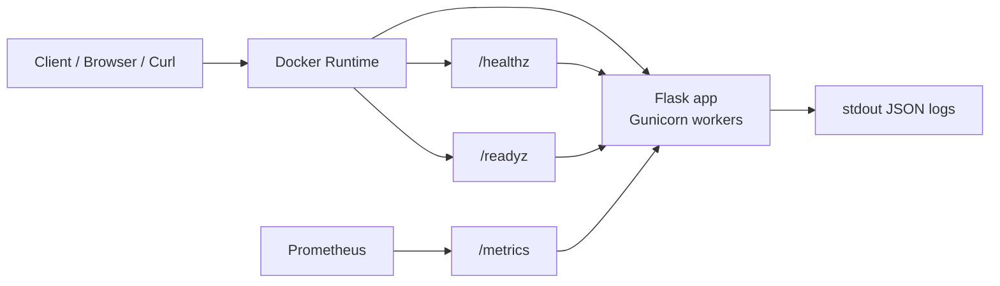
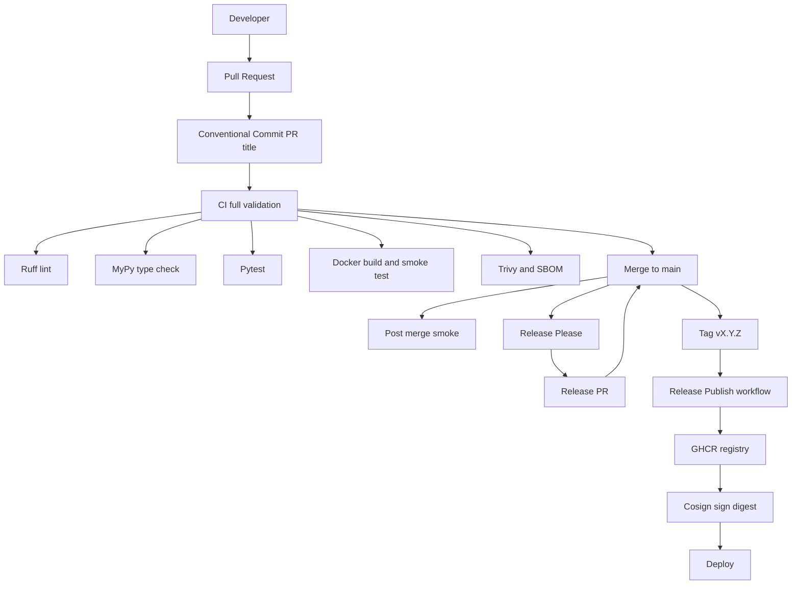

# 🚀 Add Service

Production-ready Python (Flask) web service with:

- ✅ REST API (`/add`)
- ✅ Structured JSON logging
- ✅ Health & readiness probes (`/healthz`, `/readyz`)
- ✅ Prometheus metrics (`/metrics`)
- ✅ Multi-stage Docker build
- ✅ CI optimized for PR-based validation
- ✅ Automated releases via Release Please
- ✅ Docker image publishing only on official releases
- ✅ Trivy security scanning + SBOM
- ✅ Cosign image signing (keyless)

---

# 🏗 Architecture Diagrams

## 1️⃣ Runtime (Container Deployment)



---

## 2️⃣ CI + Release Flow (Optimized)



**Key idea:** Full validation happens on PRs; `main` gets a lightweight smoke run; images are built/pushed only on release tags.

---

# 🧪 CI / Release Behavior

## 1️⃣ Pull Requests (full validation)
When a PR is opened or updated:

- Ruff (lint + format check)
- MyPy (type check)
- Pytest
- Docker build (test + runtime)
- Smoke test
- Trivy scan
- SBOM generation

➡️ This is the **full validation gate**.

---

## 2️⃣ Merge to `main` (light)
After PR merge:

- Only a lightweight `post-merge-smoke` job runs
- No heavy Docker rebuild
- No Trivy scan
- No SBOM regeneration

This avoids duplicate work.

---

## 3️⃣ Releases (publish only on official release tags)
This repository uses **Release Please** + Conventional Commits.

### How it works:

1. You merge PRs with Conventional Commit titles:
   - `feat: add X`
   - `fix: bug`
   - `feat!: breaking change`
2. Release Please opens a **Release PR**
3. You merge the Release PR
4. Git tag `vX.Y.Z` is created
5. `release-publish.yml` triggers
6. Docker image is built and pushed to GHCR
7. Image is signed with Cosign

➡️ Docker images are published **only for official releases**.

---

# 🐳 Docker Images

Images are published to:

```
ghcr.io/predrag86/sunairio
```

Tags created on release:

- `v1.0.2`
- `1.0.2`

Pull example:

```bash
docker pull ghcr.io/predrag86/sunairio:1.0.2
```

---

# 🧪 Local Development

Run locally:

```bash
docker build --target runtime -t add-service:local .
docker run --rm -p 8080:8080 add-service:local
```

Test:

```bash
curl "http://127.0.0.1:8080/add?left=5&right=2"
```

---

# 🔐 Security

### Trivy
- Scans OS + Python dependencies
- Fails PR if HIGH/CRITICAL vulnerabilities are found

### SBOM
- CycloneDX format
- Uploaded as CI artifact

### Cosign
- Keyless signing
- Uses GitHub OIDC identity
- Signs image digest

---

# 📊 Observability

- JSON structured logs to stdout
- `X-Request-ID` header returned for every request
- `/metrics` endpoint for Prometheus scraping
- Probes: `/healthz` and `/readyz`

---

# 🔄 Optimized CI Summary

| Event | Full CI | Publish Image |
|-------|---------|---------------|
| PR opened/updated | ✅ | ❌ |
| PR merged | ⚡ lightweight | ❌ |
| Release PR merged | ⚡ lightweight | ❌ |
| Release tag created | ❌ | ✅ |

---

# 🏁 End-to-End Test of Release Flow

To test the full process:

1. Create feature branch
2. Open PR with Conventional Commit title
3. Merge PR
4. Wait for Release Please PR
5. Merge Release PR
6. Pull new Docker image from GHCR

---

# 📜 License

MIT