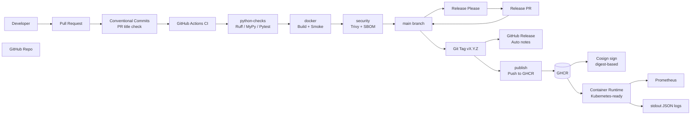

# 🚀 Add Service

Production-ready Python (Flask) web service demonstrating:

- ✅ REST API (`/add`)
- ✅ Structured JSON logging
- ✅ Health & readiness probes (`/healthz`, `/readyz`)
- ✅ Prometheus metrics (`/metrics`)
- ✅ Docker multi-stage build
- ✅ GitHub Actions CI (split into jobs)
- ✅ Trivy vulnerability scanning + SARIF upload
- ✅ SBOM generation (CycloneDX)
- ✅ Cosign image signing (keyless OIDC, digest-based)
- ✅ Dependabot grouped updates + auto-merge (patch)
- ✅ Automated releases with **Release Please** + Conventional Commits enforcement

---

# 🏗 Architecture Overview



---

# 📦 API

### `GET /add?left=5&right=2`

Returns:

```json
{
  "sum": 7
}
```

- `left` and `right` must be integers
- Returns `400` on invalid input
- Includes `X-Request-ID` header for correlation

---

# 🩺 Health Endpoints

| Endpoint   | Purpose              |
|------------|----------------------|
| `/healthz` | Liveness probe       |
| `/readyz`  | Readiness probe      |
| `/metrics` | Prometheus metrics   |

---

# 📊 Prometheus Metrics

Exposes (example):

- `http_requests_total`
- `http_request_duration_seconds`

Example:

```bash
curl http://localhost:8080/metrics
```

---

# 🧾 Structured Logging

- JSON logs to stdout
- Includes: `request_id`, `service`, `env`, `version`, latency, etc.
- Startup & shutdown events logged
- Kubernetes-ready logging model

---

# 🐳 Docker

Multi-stage build:

- `builder` → build wheels
- `test` → run pytest
- `runtime` → minimal production image

Build locally:

```bash
docker build --target runtime -t add-service:local .
```

Run:

```bash
docker run --rm -p 8080:8080 add-service:local
```

Try it:

```bash
curl -s http://127.0.0.1:8080/healthz
curl -s "http://127.0.0.1:8080/add?left=5&right=2"
```

---

# 🔐 Security

## Trivy Image Scanning
- Scans OS + Python dependencies
- Fails CI on HIGH/CRITICAL vulnerabilities (configurable)

## SBOM (CycloneDX)
- Generated automatically in CI and uploaded as an artifact

## Cosign Signing (Keyless OIDC)
Images pushed to GHCR are signed using GitHub OIDC identity (**digest-based signing**).

Verify:

```bash
cosign verify ghcr.io/predrag86/sunairio:1.0.0   --certificate-identity-regexp "https://github.com/predrag86/sunairio/.*"   --certificate-oidc-issuer "https://token.actions.githubusercontent.com"
```

---

# 🔄 CI Pipeline Jobs

1. **python-checks**
   - Ruff (lint + formatting check)
   - MyPy
   - Pytest

2. **docker**
   - Build test stage
   - Build runtime image
   - Smoke test container
   - Upload image artifact

3. **security**
   - Trivy scan (table)
   - Trivy SARIF upload (GitHub Security)
   - SBOM generation + upload artifact

4. **publish** (main/tags only)
   - Build & push runtime image to GHCR
   - Cosign sign image digest.

---

# 🧩 Automated releases with Release Please

This repo uses **Release Please** to automate:
- version bumping (based on Conventional Commits)
- release PR creation
- tag creation (`vX.Y.Z`)
- GitHub Release creation with generated notes

### Conventional Commit examples (use in PR titles)
- `feat: add /readyz endpoint` → **minor** release bump
- `fix: handle favicon without 500` → **patch** release bump
- `feat!: change /add response format` → **major** release bump

### How the release flow works
1. You open a PR with a Conventional Commit style title.
2. CI + Conventional Commits check must pass.
3. Merge to `main`.
4. Release Please opens/updates a **Release PR** (e.g. `chore(main): release 1.0.1`).
5. Merge the Release PR → GitHub creates tag `v1.0.1` + a GitHub Release.
6. Your existing pipeline runs on that tag to publish to GHCR and sign the digest.

---

# ✅ How to update and test Release Please + release notes

## A) Apply the README update (this file)
1. Replace your repo `README.md` with the updated one you downloaded.
2. Commit and push (preferably via PR):

```bash
git checkout -b docs/readme-release-please
git add README.md
git commit -m "docs: update README with release automation"
git push -u origin docs/readme-release-please
```

Open a PR and merge it.

## B) Test Conventional Commits enforcement
1. Open a test PR with a **bad** title like: `Update stuff`
2. The workflow **Conventional Commits** should fail.
3. Rename the PR title to: `docs: update readme`
4. The workflow should pass.

## C) Test automated tagging + generated release notes (end-to-end)
1. Create a normal PR with a Conventional title, e.g.:

   `fix: improve health endpoints`

2. Merge it to `main`.
3. Wait for **Release Please** to open a **Release PR**.
4. Open that Release PR:
   - you will see changelog/release notes content in the PR description/body
5. Merge the Release PR.
6. Verify:
   - a new Git tag exists: `v1.0.1` (example)
   - a GitHub Release exists with generated notes
   - GHCR has a new image tag (depends on your metadata pattern; often `1.0.1` and/or `latest`)
   - Cosign signature exists for the pushed digest

### Quick checks (optional)
- List tags locally:

```bash
git fetch --tags
git tag --list | tail
```

- Pull the release image:

```bash
docker pull ghcr.io/predrag86/sunairio:1.0.1
```

---

# 🤖 Dependabot

- Weekly dependency updates
- Grouped runtime/dev updates
- Patch updates auto-merge after CI passes
- Minor/major updates require review

---

# 📜 License

MIT